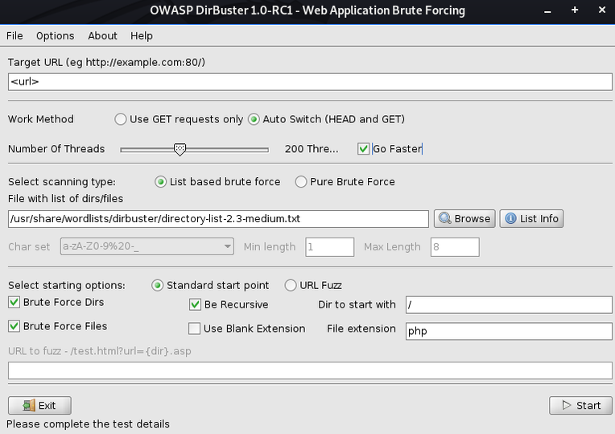

# Enumeration

## Port Enumeration

### 21 - FTP

### Anonymous Login

``` sh
ftp <target-ip>
$> anonymous
```

### Test Upload

``` sh
$> put test.txt
```

If successful, upload shell and browse to file via browser to initiate: `:::url ftp://<target-ip>/<file>`

### 22 - SSH

### 25 - SMTP

### 80/443 - HTTP/HTTPS

### Directory Busting

#### dirb

``` sh
dirb <url>
```

#### dirbuster



#### gobuster

``` sh
gobuster -u <url> -w /usr/share/wordlists/dirbuster/directory-list-2.3-medium.txt -t 20 -x php
```

### 110 - Pop3

### 111 - RPCBind

### 139/445 - SMB/RPC

### List Shares

#### nmap

``` sh
sudo nmap -sU -sS --script smb-enum-shares.nse -p U:137,T:139 <target-ip>
```

#### smbclient

```sh 
smbclient -L \\\\<target-ip>
```
### List Domain Users/Groups

#### rpcclient

``` sh
rpcclient -U "" -N <target-ip>
$> enumdomusers
$> enumdomgroups
```

### SID Enumeration

#### impacket - lookupsid

``` sh
./lookupsid.py <username>:<password>@<target-ip>
```

### WinRM

#### evil-winrm

``` sh
evil-winrm -i <target-ip> -u <username> -p <password>
```

### 161 - SNMP

#### snmpwalk

``` sh
snmpwalk -v2c -c public <target-ip>
```
